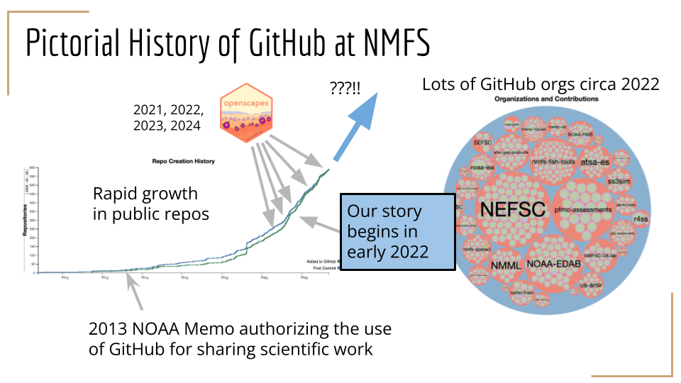
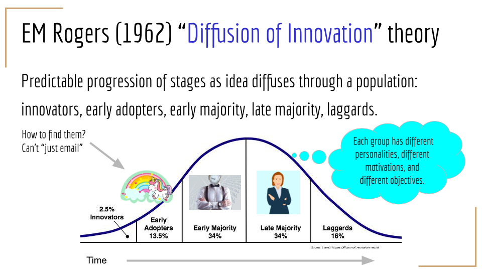
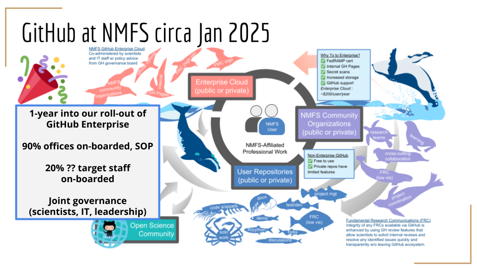

*At the 2025 ESIP winter meeting, Eli Holmes told the story of GitHub at NOAA
Fisheries, in conversation with Julie Lowndes. There were 28 participants at
this virtual session, and interesting discussions around similarities and
differences in other federal agencies.*

*Quicklinks:*

-   [*Slides*](https://docs.google.com/presentation/d/1WTVD403FCJsLoYAVAc51PG8_UoXyZmcuofZ0c-w3Wgo/edit#slide=id.g3270b11283a_1_272) *& [Recording](https://youtu.be/GPFa6_o7GRQ) - Stories of governance and open science culture change in government* 
- [*Public Session Document*](https://docs.google.com/document/d/1Twhk_K6eACMXzPXmjEjUrt7DpoF8kKam3hjdaiAWHJQ/edit?tab=t.0)
-   [*ESIP Meeting Session Info*](https://2025januaryesipmeeting.sched.com/event/1snZs/stories-of-governance-and-open-science-culture-change-in-government)

*Cross-posted at [openscapes.org/blog](https://openscapes.org/blog), [nmfs-openscapes.github.io/blog](https://nmfs-openscapes.github.io/blog)*, [*nasa-openscapes.github.io/news*](https://nasa-openscapes.github.io/news.html).

------------------------------------------------------------------------

Eli started off sharing how GitHub is software that is critical to enabling
scientists to work efficiently to track versions of their analytical code and
collaborate with their teams. It helps others not involved on a specific
project be aware and be able to reuse and extend code in new ways across the
agency, which drives further efficiencies. The project management and
publishing side of GitHub means that teams can collaborate on inventories,
documentation, standard operating procedures, and reports, without everyone
having to have the same coding skills. 

Eli shared a pictorial history of GitHub at NOAA Fisheries (figure below),
which showed how following a 2013 NOAA Memo authorizing the use of GitHub for
sharing scientific work, there was a rapid growth of public GitHub repositories
(“repos”). Openscapes has led team workshops with NOAA Fisheries since 2020 for
520 staff that included an introduction to GitHub, and when our story begins in
2022, there were lots of GitHub organizations and contributions for NOAA
Fisheries

::: {style="text-align:center;"}
{fig-alt="" fig-align="center" width="70%"}
:::

Eli shared the challenge that there was not consistent guidance about GitHub
use at NOAA Fisheries, meaning some groups used it heavily and others were told
it was forbidden. A group of science staff came together who did use GitHub,
and realized they could write best practices – they were the experts. The
[GitHub Guide](https://nmfs-opensci.github.io/GitHub-Guide/) was the start.

The guide alone did not change the reality at NOAA Fisheries, since it was
still largely unknown to people. Here, Eli made a choice: to step back and
think about her goals, and talk to others about them. Through Erin Robinson and
Ted Habermann she learned about the Diffusion of Innovation theory (Rogers
1962), and saw that growing the group of Early Adopters at NOAA Fisheries was
the key to sharing and developing the GitHub Guide, and a step towards getting
it more use and buyin across the majority of people at NOAA Fisheries. She
needed a lot more allies, with power in leadership. She went to a lot of
different meetings, listened. If they had a similar problem, she reached out,
to offer help, to be an ally. Not to ask them for anything.

::: {style="text-align:center;"}
{fig-alt="" fig-align="center" width="70%"}
:::

The Diffusion of Innovation theory has something important between early
adopters and the majority: a chasm. It’s very difficult to cross this chasm
because it means a different set of skills and talking points: it’s about
convincing leadership about github rather than convincing scientists to learn a
new software. The chasm seems so difficult to cross, and many times it is
impossible and the effort stops. But Eli saw a change to make that could help
cross the chasm: relinquishing the idea of the free “open source” GitHub, and
instead proposing GitHub Enterprise and working with IT.

**How GitHub Governance at NOAA Fisheries looks today:**

* 1-year into our roll-out of GitHub Enterprise 🎉  
  * 90% offices on-boarded, SOP  
  * 20% ?? target staff on-boarded  
  * Joint governance(scientists, IT, leadership)  
    * Wanted a seat at the table. Wasn’t enough to be consulted.   
  * We can talk about HOW policies are made and WHO should have a voice in them. \- better ways to create rules; engage people who are being “ruled” as people with experience and needs

::: {style="text-align:center;"}
{fig-alt="" fig-align="center" width="70%"}
:::

