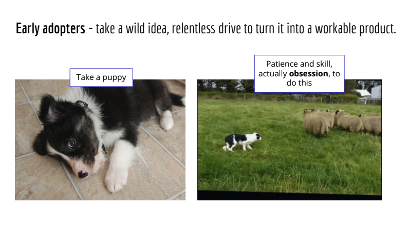
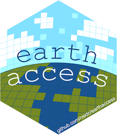

*We led 3 concurrent [Openscapes Champions](https://nmfs-openscapes.github.io/champions.html) Cohorts for NOAA Fisheries this fall. These were cohorts 14 to 16 for NOAA Fisheries, involving over 600 staff and affiliates in total! Participants included teams and individuals from all 6 NOAA Fisheries Centers - [Pacific Islands](https://www.fisheries.noaa.gov/about/pacific-islands-fisheries-science-center), [Southwest](https://www.fisheries.noaa.gov/about/southwest-fisheries-science-center), [Southeast](https://www.fisheries.noaa.gov/about/southeast-fisheries-science-center), [Northwest](https://www.fisheries.noaa.gov/about/northwest-fisheries-science-center), [Northeast](https://www.fisheries.noaa.gov/about/northeast-fisheries-science-center), [Alaska](https://www.fisheries.noaa.gov/about/alaska-fisheries-science-center) - along with the Office of the Chief Information Officer ([OCIO](https://www.noaa.gov/organization/information-technology/about-ocio)), Office of Science and Technology ([OST](https://www.fisheries.noaa.gov/about/office-science-and-technology)), National Ocean Service ([NOS](https://oceanservice.noaa.gov/)), Integrated Ocean Observing System ([IOOS](https://ioos.noaa.gov/)), Southeast Regional Office ([SERO](https://www.fisheries.noaa.gov/about/southeast-regional-office)), West Coast Region ([WCR](https://www.fisheries.noaa.gov/about/west-coast-region)), Pacific Islands Regional Office ([PIRO](https://www.fisheries.noaa.gov/about/pacific-islands-regional-office)), and Office of Protected Resources ([OPR](https://www.fisheries.noaa.gov/about/office-protected-resources)). This post is a summary and celebration of some of their work.*

*Quicklinks:*

-   [*Cohort webpage*](https://nmfs-openscapes.github.io/2025-nmfs-champions/)

-   [*Browse stories*](https://openscapes.org/blog#category=noaa-fisheries) *about the NOAA Fisheries Openscapes framework*

*Cross-posted at [openscapes.org/blog](https://openscapes.org/blog), [nmfs-openscapes.github.io/blog](https://nmfs-openscapes.github.io/blog).*

------------------------------------------------------------------------

# Cloud Migration and Data Preservation progress happens with collaboration

As NOAA is migrating data to the cloud, this means many people are needing to change their workflows. What Openscapes has learned over the years is that a big part of changing workflows is helping people make connections so they can help each other. Champions Cohorts connect people within and across their home centers as they learn new skills for data workflows that are immediately relevant for their work. And this enables change that wasn’t possible before.

One exciting example of something that wasn’t possible before is the [NOAA Fisheries Cloud Computing Setup](https://github.com/nmfs-opensci/CloudComputingSetup/) documentation that NOAA Fisheries Mentor Molly Stevens started in preparation for the Champions Cohort (following six months of [collaborative testing](https://github.com/orgs/nmfs-openscapes/projects/46/views/6?filterQuery=workstation&pane=issue&itemId=102920703&issue=nmfs-openscapes%7Chow-we-work%7C33) with other Mentors). When Alex Norelli learned about it while participating in the Champions Cohort, she found this setup resource valuable for her own work. She began collaborating with Molly to test it, achieving something she could not do before the Cohort started: “I benchmarked different cloud environments and explored data management solutions like Google Cloud Buckets, which sparked so many seaside chats about best practices in migrating current workflows to the cloud”. Ultimately, Alex co-led a Google Workstations Clinic during the last weeks of the Cohort with Molly Stevens, SEFSC, and Jon Peake from NMFS Open Science, which benefitted additional participants and helped further develop the documentation. This example embodies how change happens within organizations: people are able to do more together than they can alone. And it starts with the practice of creating something useful for others, sharing it early, and iterating together.

Over two months in fall 2025, 100 NOAA Fisheries staff tackled projects to improve or restructure data workflows through the Openscapes Program. They made substantial progress on complex workflow goals, such as:

-   Benchmarking cloud data storage solutions;

-   Getting feedback on data modernization policy and needs;

-   Developing workflows exclusively in the cloud to align with NOAA Fisheries modernization goals;

-   Creating dashboards to communicate data-heavy reports with programmatic code and version control;

-   Contributing to coordinated science program onboarding and operating procedures that are harmonized across NOAA Fisheries;

-   Exploring how AI can enhance their workflows.

The Openscapes team worked with [NOAA Fisheries Openscapes Mentors](https://nmfs-openscapes.github.io/mentors/) – staff and affiliates from across centers and offices – to invite colleagues to participate, organize and teach lessons and skill-building workshops, lead small group reflection time, and facilitate coworking sessions. During coworking sessions, participants could brainstorm and make progress on what mattered to them with others working on similar tasks.

# Fall 2025 Cohorts - what was new

Adapting our standard Champions Cohorts, we made more space for NOAA Fisheries Openscapes Mentors and NOAA leadership to share new tools and policies for cloud migration.

-   Michael Liddel (OST - Assistant Chief Data Officer) and Heather Nicholas (Office of the CIO) hosted [Seaside Chats](https://openscapes.github.io/series/what-to-expect.html#seaside-chats-coworking) on Cloud migration and Data Optimization while participating as Champions and learning about science staff needs.

-   Eli Holmes (NMFS Open Science) developed and taught a new lesson on Cloud Strategies for Future Us ([recording](https://youtu.be/MLWMzMDjif8)).

-   Molly Stevens (SEFSC), Alex Norelli (SEFSC new Champion), and Jon Peake (NMFS Open Science) documented the [NOAA Fisheries Cloud Computing Setup](https://github.com/nmfs-opensci/CloudComputingSetup/) and developed and hosted a Google Workstations Clinic.

-   Kathryn Doering (OST) presented on [Infrastructure and support at NOAA Fisheries](https://docs.google.com/presentation/d/1d74JVjc1Ndh4L__qM5AgMiRLLQdI7rJb/edit?slide=id.p1#slide=id.p1).

-   Erin Steiner (NWFSC/OST) launched and [presented on](https://docs.google.com/presentation/d/1g72oUWLu3pi3SO5rkUk6ANULGsvf0jhWfQ9xgoQKUVk/edit?slide=id.p#slide=id.p) the new [GitHub server for confidential information](https://github.nmfs.local/) now available across NMFS.

We also partnered with [Intertidal Agency](https://www.intertidalagency.org/)’s Kate Wing and Rachael Blake to teach new lessons to address the theme of data preservation: [Metadata - Documenting your Data](https://docs.google.com/presentation/d/1fvAGMc1FsoEoog3OVU2xBjfP6_pNmhaQlNs7OjSidNc/) and a [Zenodo Clinic](https://openscapes.github.io/series/additional-lessons/zenodo-clinic.html). These were built from an [ESIP summer conference](https://openscapes.org/blog/2025-11-16-esip-july-2025/) session “Archive your first or second dataset”. This is a powerful partnership; Intertidal is leading a Data Stewardship Cohort shortly ([registration open](https://www.intertidalagency.org/stewardship-training)!) and will reuse the Openscapes Champions structure and some of these lessons. The Zenodo Clinic replaced our regular [GitHub Clinic](https://openscapes.github.io/series/core-lessons/github/). However, the GitHub Clinic is something people asked for, as it has been recognized by many as a friendly onramp to GitHub concepts and collaboration. We taught aspects of the GitHub Clinic in three coworking sessions with small groups that included both beginners and more experienced users.

# What NOAA Fisheries staff accomplished: learning and shifting workflows

In the final cohort call, people are invited to share their work-in-progress using our [Pathways tool](https://openscapes.github.io/series/pathways.html#pathways-concept) for identifying how they work now along with their goals and progress.

**We saw several themes** popping up: asking for help; “slowing down to speed up”; seeing what’s possible; testing things together - like cloud infrastructure - checking in with each other during seaside chats, trying to make things work, comparing workflows; sharing templates for workflows, like project management approaches for cyclical stock assessment reports.

We also saw that many more people participated as individuals rather than in teams this time including some who are collaborating with IT colleagues at several centers. This is why the experience of “learning all of the faces; these are people doing the same work I'm doing” and knowing who to ask for help is so valuable, while often underappreciated as an impact of cohort-based learning.

::: blockquote-blue
> "The biggest benefit in this regard was meeting others across the organization faced with similar problems and using similar tools."- **Greg Ellis, NEFSC**
:::

::: blockquote-blue
> "It already helps to realize that we are a much larger group with an ample common space to share and contribute ideas and different ways to tackle challenges and improve our workflows."- **Raul Ramirez, AFSC**
:::

Here are some examples from those presentations during our final call together.

## Cloud examples

### Management Strategy Evaluations (MSE) Cloud Workflow

Desiree Tommasi (SWFSC), Liz Brooks (NEFSC), and Alex Norelli (SEFSC) are stock assessment scientists from three different science centers who all work on Management Strategy Evaluations and were able to connect through Openscapes. MSE simulations deal with a LOT of data, and a single stock assessment run can take from 5 to 45 minutes, so cloud computing is critical to make this faster. Learning “the cloud” can be intimidating but having a space and peers to "interrogate the heck out of things” is a huge contribution to learning. Their Seaside Chats began with Alex sharing her process and together they learned from there.

Questions, philosophical discussions, and compiled notes led to an MSE Cloud Workflow with recommendations for prep, setup, and run and archive phases, and helped Alex contribute to the Google Cloud Workstation workshop ([documentation](https://github.com/nmfs-opensci/CloudComputingSetup/); with Molly Stevens (Mentor, SEFSC) and Jon Peake (NMFS Open Science)). The team shared main issues and their current solutions in their pathway presentation (image below). For example, they learned that Google Cloud Workstations don’t have enough storage or power (cores) for their outputs. They had to divide their pipeline across multiple Workstations in order to do the work. They are having ongoing talks with their local IT staff and the Pilot Workstation team and are hopeful for a future “dream workstation” – which will be valuable for many people at NOAA Fisheries, not just them.

IMAGE

*Caption: Major milestones in testing Google Cloud Workstations for MSE, listed as Issues (left) they identified and their current solutions (right).*

### Exploring cloud workflows for species distribution modeling

Josh Cullen and Heather Welch work in the SWFSC species distribution modeling (SDM) group. While they each work on different projects, they had the mutual goal of exploring the cloud with their workflows, identifying improvements and snags, and helping others in their group with migrating their workflows to the cloud.

Josh works on daily forecasts of fishing conditions for target species and bycatch. He recognized that people can improve workflows for both ecological modeling and operational tools by “shifting to a cloud-based approach using the ’cloud native’ Zarr format to stream large datasets from any computer or Virtual Machines (VMs)”. Meanwhile, Heather compared the performance of VMs. VMs have machine types that vary by compute power and memory as a trade off with cost. Heather presented her work benchmarking the performance of VMs with CPUs vs GPUs.

### Workflow transformation for procurement: field camp preparation and gear purchasing

Christy Kozama of PIFSC focused her time during Openscapes Champions exploring how her procurement pipeline could be improved. Procurement (also known as how purchasing and buying stuff, say, computers or fishing gear, works within an organization) may not be what comes to mind when we think about data at NOAA Fisheries. But procurement data is indeed a part of the whole picture, and there is a process and many decisions and documentation that go into it. For example, “market research” (image: top, second to the left) comparing prices and vendors – as well as tracking and process and documentation – has the money been sent, has the item been received, does the scientist or original requester now have it? As part of NOAA Cloud migration, NOAA staff are also encouraged to be using AI more. With that in mind, Christy explored what her procurement pipeline could look like using AI-driven tooling (image: bottom, second to the left).

IMAGE

*Caption: Progress report on communication* 

Megan Wood and Kait Palmer (PIFSC) collaborated on Makara database transition with an Openscapes mindset. They used GitHub Issues to leave breadcrumbs in a single thread instead of sending an email that would lead to 17 followup emails.

The Hatchery Compliance team (WCR) of Alan Olson, Chante Davis, Krista Finlay, John Brady, James Archibald, Kellen Parrish produces “biological opinions” with a “compliance letter” as the endpoint of their workflow. Determining if a scientist is in compliance is based on a long complex set of terms and conditions. They built a Gemini Gem (AI) to save scientists time by drastically narrowing down the areas the scientist likely needs to address further to be in compliance.

Jenny Stahl (PIFSC) SAFE document (Stock Assessments and Fishery Evaluation) google doc breaking down where things are - repo, Quarto files, R code, what’s the output - html or pdf and recommended improvements Part of her improvements were identifying where they have overlapping code.

# Mentors impact – building from over 5 years of collaboration

After five years of working with NOAA Fisheries, we’re seeing Openscapes practices really become a movement. People are learning from each other (“now we see that our team leads were ‘Openscapesing’ us all along with their open process!”). Champions are becoming Mentors and turning around to share with new Champions (like the project management example above) and inside their divisions as they see needs, and mentoring through seaside chats, building, and sharing to address those needs. We’re seeing the Openscapes approach reach beyond the early adopter innovators to the early majority.

The impacts we see now build on work that develops over years. The Google Workstations Clinic that Molly Stevens, Alex Norelli, and Jon Peake delivered stemmed from a [MentorActivities Issue](https://github.com/orgs/nmfs-openscapes/projects/46/views/6?pane=issue&itemId=102920703&issue=nmfs-openscapes%7Chow-we-work%7C33) on the topic from early 2025, and Molly ran with it. That first issue has turned into a huge and ongoing impact across NOAA Fisheries.

It shows up in other ways too. Loren Stearman (NWFSC) is focusing on psychological safety with the teams he works most closely with. He is working on how to help bring Openscapes principles beyond data workflow contexts. The human side and safe environments for communication is so critical to the longevity of the projects he works on and he is helping other Mentors across NOAA Fisheries prioritize and have language for these conversations.

Perseverance and envisioning what’s possible is another characteristic of NOAA Mentors. Erin Steiner (NWFSC) saw the need for a GitHub server for confidential data and did not give up, spending 9? months convincing people that there was both a need and a solution. She shared this as a Pathway for the 2025 fall Champions cohort. The hardest part of this is not being willing to quit, even when she was told she was using GitHub wrong (she was not!). It is hard to know what was different between the 8th version of a pitch email and 9th, but it was that 9th email that gained traction to make it happen. And ultimately, she was successful because she was not doing this alone: she was able to reuse (“fork”) the approach Kathryn Doering (OST) took for GitHub Governance (seeing what’s possible), and had the encouragement of Kathryn and others along the way.

# Reflections: Crossing the Chasm with Innovators and Early Majority

This year’s NMFS Openscapes Champions program was different in two big ways that were happening simultaneously. We are reaching new audiences, having worked with NOAA Fisheries for so many years, and led 16 Champions Cohorts with them. Thinking about the [diffusion of innovation](https://openscapes.org/blog/2025-05-13-cng-conf/) theory; for the past years we have been investing in the "early adopter” community by supporting the NOAA Fisheries Mentors and Champions cohorts. In 2025, we focused on sharing the story of how we had “crossed the chasm” and would now be working more with the early majority. The Fall 2025 Champions Cohort was the next part of the story: we had “early majority” folks –as well as “innovators” who are developing new infrastructure and workflows for cloud computing.

What does this mean for how we engage and teach NOAA Fisheries Champions going forward? Will the spectrum of goals that NOAA staff have broadened in a way that the support we give people will look different in the future? We’ve always designed Champions Cohorts to not assume prior knowledge of coding or GitHub or any specific dataset or type, and we’ve designed so that people with different expertise and deliverables, like supervisors and analysts and IT staff, can all learn together and take what they need back to their work. However, we need to think more about what Openscapes Champions looks like when the spirit of “data workflows” is not a unifier for all participants. While we will need to listen and innovate to meet these new needs, we will also remember to pause and reuse what has worked in the past: the value of welcome, art, show-not-tell, empathy, and community. And a constant reminder that we’re not alone, it’s not too late.

**An image:**

::: {style="text-align:center;"}
{fig-alt="text to describe the image" fig-align="center" width="85%"}
:::

**An image with text beside it**, added by using columns. Column widths must add up to 12:

::::: grid
::: g-col-2
{fig-alt="The earthaccess logo by Allison Horst: a hexagonal shape with the words earth access on two separate lines with pixelated sky with clouds and earth with land and sea" fig-align="left" width="100%"}
:::

::: g-col-10
Join us to celebrate `earthaccess`, a python library that simplifies search and access of NASA Earth science data to a few lines of code.

We will record the presentations and post on [Openscapes YouTube](https://www.youtube.com/@openscapes/videos).
:::
:::::
