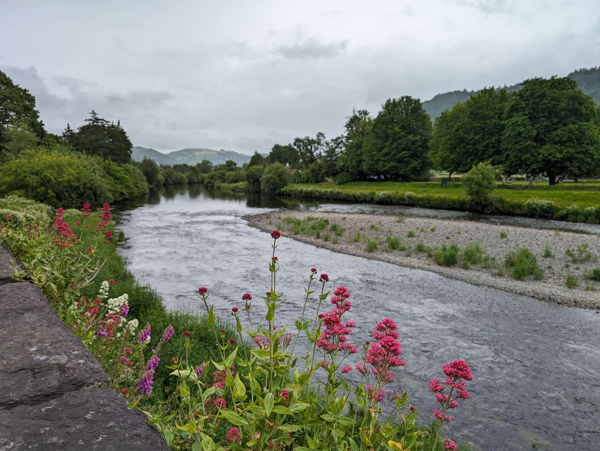

*Hi friends, Openscapes as an open source community is strong and resolved to support science and open source work, and to show up for each other. And Openscapes, the small core team I lead is also strong, resolved, and gratefully, funded. We have been building resilience for open science work by simultaneously focusing on our business architecture, which I first [wrote about in July 2024](https://openscapes.org/blog/2024-07-18-openscapes-update/). The 2024 post summarized the Openscapes ethos and impact igniting real culture change across science. Here I focus on building resilience for Openscapes work through two small companies I founded in the US and UK as a way to continue supporting open science and open science jobs with [current threats to US federal science programs](https://spacenews.com/suspended-noaa-satellite-chief-warns-of-threats-to-federal-science-programs/). We are here together, are grateful to be a part of your community and this huge effort supporting science.*

*Cross-posted at [openscapes.org/blog](https://openscapes.org/blog), [nmfs-openscapes.github.io/blog](https://nmfs-openscapes.github.io/blog), [nasa-openscapes.github.io/news](https://nasa-openscapes.github.io/news.html).*

------------------------------------------------------------------------

## Being values-driven and strategic in open science work and in business architecture

At Openscapes, we focus on mentoring scientists and people supporting science to upskill around collaboration and open science. Openscapes has been values-driven and strategic in this work, and we see impact[^1] as much due to team cohesion and increased morale as it is due to any automation and efficiency provided by technology. We call this “kinder science”: as I wrote in [Open Software Means Kinder Science](https://www.scientificamerican.com/blog/observations/open-software-means-kinder-science/) in 2019,

[^1]: This January we wrapped up [3 Champions Cohorts with 120 NOAA Fisheries staff](https://nmfs-openscapes.github.io/champions.html) focused on cloud migration and data preservation, supported by [30+ mentors](https://nmfs-openscapes.github.io/mentors/) from across the agency. We are also following up from two NASA [earthaccess](https://earthaccess.readthedocs.io/en/stable/) events this fall that [welcomed new adopters](https://openscapes.org/blog/2025-11-27-nasa-champions-2025-summary/) and [contributors](https://openscapes.org/blog/2026-02-04-earthaccess-dec15-hackday/) to the earthaccess python library.

::: blockquote-blue
> *"*Open science is not just about improving the way we share data and methods; it is also about improving the way we think, work and interact with each other. It’s about technology enabling social infrastructure that can promote inclusivity to create kinder science.*"* - **Julie Lowndes.**
:::

Openscapes has been working to bring kinder science to our open science work, but also to our business strategy & architecture work. We bring our creativity, openness, and curiosity; we experiment and [fork/reuse](https://docs.google.com/presentation/d/10RbeoshmsHx06ZIFA1x-KERbrMkcBtnOtFVyt9UCs5o/) what works. In 2022 I founded Openscapes LLC, a small US company to administer funding for people building careers in open science. I wrote about the structure and motivation in the [2024 post](https://openscapes.org/blog/2024-07-18-openscapes-update/#structure). As a scientist, I didn’t have business experience or savviness. But the growth mindset ([power of yet](https://youtu.be/_X0mgOOSpLU)) gave me confidence that it was a skill I could develop. I am developing business skills through partnering with Melanie Burgess and Stephanie Amend, who are part of the [Openscapes Core Team](https://openscapes.org/team) co-leading our strategy and business architecture. Melanie and Stephanie build “kinder science” values into Openscapes as a business through our contracts and accounting systems. We've designed our systems in service of the open data science work, for example being able to accept multiple sources of funding to contribute to a single project so that people with different job classifications can participate in the same Openscapes Cohort. We are open when writing contracts with partners in part through sharing editable (Word or Google Doc) draft versions of contracts to start a conversation (rather than something that seems final or unchangeable (PDF or DocuSign)).

Kinder science also shows up in our business when we share strategies with other small business and non-profit partners in the greater open ecosystem. Melanie and Stephanie are small business owners themselves. It has been and continues to be an amazing learning journey and empowering experience for me to work with people with aligned values with different skillsets to support Openscapes work. 

## International business strategy for sustainability and resilience

In 2025, I founded Openscapes Collaborative LTD, a small UK company, to build resilience for the open science movement and for Openscapes. The LTD also exists to administer funding for people building careers in open science, and was sparked by my family moving back to the UK. Melanie and Stephanie continue to be integral in this learning journey together. I continue to lead the US Openscapes LLC and its work; the two companies are wholly separate but complement each other by sharing values and reusing strategies.They both are values-based vehicles to support the broader Openscapes and open science communities. These changes have sparked us to focus on other business architecture as we’ve grown, including developing our Privacy Policy, standardizing our contract processes, and collaborating with international partners.

In 2026, we are also thrilled to be partnering with the [European Space Agency (ESA) EarthCODE](https://earthcode.esa.int/) project! This work is possible because of being [recognized for kinder science in our open science work](https://openscapes.org/blog/2024-10-03-openscapes-recognized-white-house) and our business strategy of setting up a UK entity. Being part of the global open science movement, we have been interested in international collaborators for Openscapes for a long time. Our whole Openscapes team focused on building infrastructure and relationships to make an ESA Champions Cohort possible. [Nominations are open](https://openscapes.org/events/2026-04-15-esa-champions/) for our first ESA Champions Cohort in Spring!

In 2026, we have also increased our work with NASA, [supporting suborbital teams](https://openscapes.org/blog/2026-03-03-suborbital/) through “growing the family” of NASA Openscapes Mentors and science teams with a focus on open source science and notebooks – stay tuned for Fall. We have welcomed a new team member for this project, [Ronny Hernández Mora](https://openscapes.org/team#openscapes-core-team)!

We are so grateful to continue our work supporting and collaborating with the amazing people and dedicated teams of US federal scientists and science teams who support environmental and climate solutions. You all are heroes and we love you and are here for you.

## Asking for help - the lesson I keep learning

At the end of her podcasts, Brené Brown asks her guests “what is the leadership lesson the universe keeps presenting to you that you keep relearning?” For me, it is asking for help. This fights the default feeling of aloneness that I can feel: I remember what we teach in Openscapes Cohorts, that “you’re not alone, it’s not too late”. For me, pausing, looking around, and thinking about who can help is a way to remember that I’m not alone. 

I continually relearn how powerful “default to open” and asking for help are. Something that sticks with me is from core team member Andy Teucher, saying “When you ask for help, I get to learn.” When Andy said this to me, it was a real gift. Asking for help is hard for me, and framing asking for help as a learning opportunity that also strengthens the work and the team is empowering. I know asking for help is a challenge for many colleagues, having been trained to dig in and figure things out alone. But, we can’t do it all alone. Asking for help is a huge gift for me, and along with offering and receiving help, is a strategy and practice for us all going forward.

::: {style="text-align:center;"}
{fig-alt="photo focal point is a narrow river with central sandbar, flowers in foreground along the river are dark pink and white, trees along riverside and hills in background" fig-align="center" width="70%"}
:::