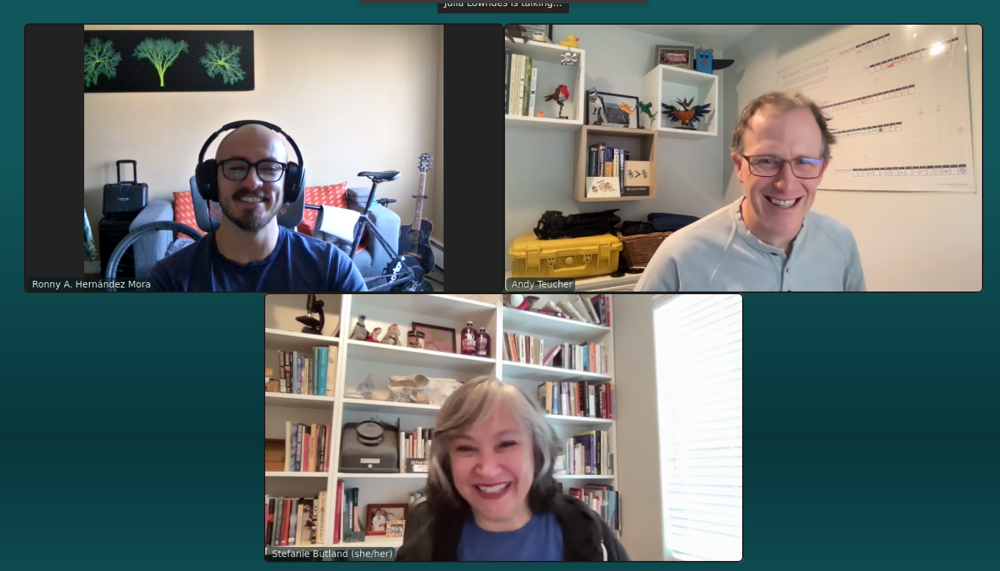

*I’m Ronny A. Hernández Mora, the newest member of the Openscapes Core Team.
Starting this position at Openscapes has given me the opportunity to get to know
my colleagues Stefanie Butland and Andy Teucher more closely. I was in charge of
conducting an interview with them (something I had never done before) so I’ll
admit I was a bit worried. Fortunately, Stef and Andy made it easy by sharing
tons of interesting stories and insights from their careers.*

*This conversation is my attempt to learn and share what keeps them excited about
their work at Openscapes. We discussed their recent work, including “tell me two
things you’re proud of”, as well as their career paths, and what drives them.*

*Cross-posted at [openscapes.org/blog](https://openscapes.org/blog), [nasa-openscapes.github.io/news](https://nasa-openscapes.github.io/news), [NMFS-Openscapes](nmfs-openscapes.github.io/blog)*.

------------------------------------------------------------------------

::: {style="text-align:center;"}
{fig-align="center" fig-alt="3 screenshots of zoom participants. People are smiling."}
:::

## “Two things I’m proud of”

As of January 2026, Stef has co-led 19 Openscapes Champions cohorts, including 3
concurrent cohorts for NOAA Fisheries that just completed ([blog
post](https://openscapes.org/blog/2026-02-26-nmfs-champions-2025/)). During this
experience, one thing struck her: seeing open science practices really become a
movement inside NOAA Fisheries\! Part of the work Stef does is support the [NOAA
Fisheries Openscapes Mentors
community](https://nmfs-openscapes.github.io/mentors/). This means leading
coworking in groups and 1:1, facilitation, communication, building tech
infrastructure, and helping individuals recognize how important and powerful
their unique skills and experiences are – something that she is the most proud
about.

She also openly documents ***how*** **we work** in the Openscapes [Approach
Guide](https://openscapes.github.io/approach-guide/) – including example emails
– so processes can be reused. Currently part of this work is to document
strategies and infrastructure for engaging with new groups for our Champions
program, based on a first-time cohort for scientists affiliated with the
European Space Agency. And, something that I much appreciate, is her time and
effort to onboard me as we set up a first-time [Champions cohort for NASA
Suborbital scientists](https://openscapes.org/blog/2026-03-03-suborbital/) with
a short turnaround time. 

Andy has been involved in coordinating and supporting workshops run by both NASA
and NOAA Mentors. They use JupyterHubs that we host in partnership with
[2i2c](https://2i2c.org/), so participants have a common computing environment
set up and ready to go. Andy created
[openscapes.cloud](https://openscapes.cloud/) to pull together all of the
documentation for setting up and running a workshop using one of these Hubs, and
is currently working on making the process of requesting and setting up the Hub
for a workshop more efficient, through the use of [issue
templates](https://github.com/NASA-Openscapes/workshop-planning/issues/new?template=01-nasa-openscapes-workshop-template-form.yml)
and Google Sheets.

Andy has created [tools](https://github.com/Openscapes/jupycost) and
infrastructure for [cost monitoring and
reporting](https://openscapes.cloud/usage-reporting.html), and worked with 2i2c
to help create and test internal monitoring tools using Grafana. These tools
help to understand and report on who is using the Hubs, what kinds of resources
they are using, and how much it costs. For him it’s really gratifying working on
these projects with the amazing folks at 2i2c (Yuvi, Jenny Wong, April Johnson,
Angus Hollands) as well as the NASA and NOAA Mentors who lead events to teach
their peers, and also test and communicate back their needs. One fun technical
thing he did recently was to figure out a streamlined process and document [how
to SSH into the Hub](https://openscapes.cloud/ssh-into-hub.html).

Another part of Andy’s work that he finds especially gratifying is running the
“[Data Academy”](https://nmfs-openscapes.github.io/data-academy) for NOAA
fisheries staff learning R. Scientists sign up for a learning cohort, and follow
a customized curriculum on [dataquest.io](http://dataquest.io), with Andy
guiding them through the process. He hosts a weekly help desk where he
demonstrates that week’s lessons or a special topic, and provides a space for
Q\&A and/or quiet coworking. The format is in continuous change based on what
works best for learners. For example, sessions are recorded for those who cannot
attend live, and there are “break weeks” so participants can catch up. Stef has
been instrumental in refining the structure as they iterate together.

## Paths to Openscapes

Both Stef and Andy began their career in the life sciences. Stef obtained her
master’s in biology, specifically fruit fly behavior genetics, in 1993 from York
University in Toronto, Canada. Andy did his master’s in ecology at the
University of Calgary, graduating in 2006\. From there, they move in a different
direction but with some common points that I found interesting (open science,
workflows, etc.) 

Stef decided to move to Vancouver, without a clear idea of what to do with her
career at a later stage, so she took a job as a lab bench molecular biologist
research assistant, for which she already had the skills. Despite thinking
initially that it was going to be for one year, it ended up being five years.
This didn’t happen just because. It had to do with the team culture she found
there, the supervisor and the growth mindset they had. As she shared her story,
Stef mentioned that during her career there were some “watershed moments”
(highly influential moments in her career), such as one where a lab member
installed an early web browser in the lab computers. This was around 1995-1997,
so having a connection to the Internet meant access to  free public databases of
DNA sequences from which you could infer and compare protein, amino acid
sequences.

This moment marked Stef’s transition into bioinformatics and her first exposure
to what we now think of as open science and freely accessible data and tools.
What I like about Stef's story is that her curiosity and passion didn’t stay
confined to technical work, but in parallel she was also building community
through initiatives like co-founding the Vancouver Bioinformatics Users Group \-
[VanBUG](https://www.vanbug.org/) in 2002, and sharing what she was learning. 

The connections made through those experiences were important. She got to know
Jenny Bryan, who at the time was  part of the [rOpenSci](https://ropensci.org/)
leadership advisory group. Jenny eventually sent her the job description for a
Community Manager role at rOpenSci, telling her, “I think this job description
is you.” And this is how Stef started at rOpenSci in September of 2016\. Stef
described this as something she is particularly proud of. 

Stef describes her time at rOpenSci as another watershed moment in her career.
She stepped into a role that didn’t exist yet, which she helped to define, with
an initial focus on organizing the [2017
unconf](https://ropensci.org/blog/2017/06/02/unconf2017/). Having that clear
focus, and the space to grow into the role, everything else began to fall into
place from there. During her time at rOpenSci, and specifically at the
conference, she met Julie and Andy, which later would become important as a next
step in her career. After nearly six years working with rOpenSci, she felt the
role needed a new person who could bring other skills, so she decided to step
away and resigned from that position proactively. 

After leaving rOpenSci, Stef took the time to reflect on what she wanted her
work to feel like and recognized that Openscapes was a place which aligned with
what she was looking for. The timing was good – she was able to join the team in
April 2022, initially a few hours a week, and gradually expanding over time. 

This, in many ways, tells that not always a linear path exists, and instead
there are watershed moments (as Stef likes to say) that can lead us to new and
exciting opportunities. Especially driven by the people you work and connect
with. Also, for Stef, having a science background is key to feel on a level with
the people she works with and teaches.  

Andy’s path into Openscapes was shaped initially by his work in the government
of British Columbia. He started with species conservation assessments, which led
him to start using R to automate and make processes more efficient. He made his
way through various parts of the BC government, inside the Ministry of
Environment, and then also in BC Stats, the statistical agency.

It was through that work that Andy began to develop and promote practices for
open science by using open data, open source software, reproducibility,  and
also, publishing the code. This was super important for trust of government
organizations and also efficiency for scientists getting things done. On this
end, Andy highlighted the role of collaborators like Stephanie Hazlitt and Sam
Albers, who were a big part of that journey. He later joined
[Posit](https://posit.co/) as a package developer educator on the tidyverse
team, which he described as a dream job. During his time at Posit he had the
chance to work and learn from people like Jenny Byran and Tracy Teal. That
experience was unexpectedly short-lived, however Andy still gained a lot from
his time there, building good relationships and learning a lot, especially about
the way the tidyverse team works to be productive, inclusive, and
community-focused. Up to this point in his career, much of the Openscapes ethos
was already starting to take shape in his work.

After Posit, Andy started to work on his own as a consultant, something that he
had previously considered but never done. Around that time, he reconnected with
Julie, whom he had first met through the rOpenSci community and later again at
posit::conf(2023). When Openscapes advertised for a cloud team member, it
sounded like an amazing opportunity, so he applied and was offered the job in
spring of 2024\. The combination of fun and challenging technical work, some
teaching, and collaboration with amazing scientists through open science
practices has been incredibly rewarding for him.

## Learning and Skills

Something Andy and Stef both emphasized was the importance of continual learning
and skill-building throughout their paths. And this is something they continue
to do and role-model at Openscapes. 

When talking about learning and skills, Stef mentioned something that is easy to
overlook: the role of creating relationships. For her, community building isn’t
separate from the technical work, it’s actually what makes it possible. Much of
the effort on maintaining connections between people, or shaping the processes
that support the group of people working on it, has a lot of impact on the
success of a project. What stands out in Stef’s approach, is her ability to
connect layers: understanding tools well enough to use them effectively, while
also creating the conditions for the people to engage with them. She is capable
of translating between the technical and the human side of workflows, making
them work much better.

One of the main characteristics in this process is the ongoing learning process.
It’s an iterative process, practical, embedded in Openscapes ethos. For example,
the [Openscapes Reflections program](https://openscapes.github.io/booklet/)
helps people think through and identify what feels clunky in a workflow, and
leads to actions to improve it. Learning becomes practical by reducing friction
and improving by small continuous changes.

“Confidence in yourself and constant learning” – that’s the message I take from
Andy. For him, it is not about knowing everything upfront, but knowing that you
always have something more to learn, and trusting that you can figure things out
when needed. Knowing that you can put in the effort to find answers, to solve
problems is an important skill.  This aligns closely with Openscapes [growth
mindset](https://openscapes.github.io/approach-guide/approach/#growth-mindset),
which helps to keep him engaged, to feel challenged, because motivation can drop
when you stop learning. Beyond the technical skills such as expanding the
background in R to Python and cloud workflows, he has been learning about
developing more intentional community and communication skills.

## Closing

*I’ve always been curious about the paths people I admire have taken: the
decisions, opportunities, encounters, and moments that led them to where they
are today. It is always amazing to hear their stories, and how non-linear a
career path could be. I also like how people navigate moments of uncertainty,
how they recall those stages that shaped them, and what motivates them along the
way.* 

*As I start this new [role with Openscapes and the NASA-suborbital
team](https://openscapes.org/blog/2026-03-03-suborbital/), I’m excited to work
with Stef and Andy, learn from them while bringing my expertise, experience,
questions, and ideas to the group. Who am I? I’m a researcher and a software
developer at the intersection of perception-driven systems, computer vision,
deep learning, and remote sensing. Over the past eight years, I’ve worked with
people in academia and industry to adopt collaborative, open, and maintainable
workflows in real-world contexts. I look forward to contributing to the
Openscapes community\!* 

