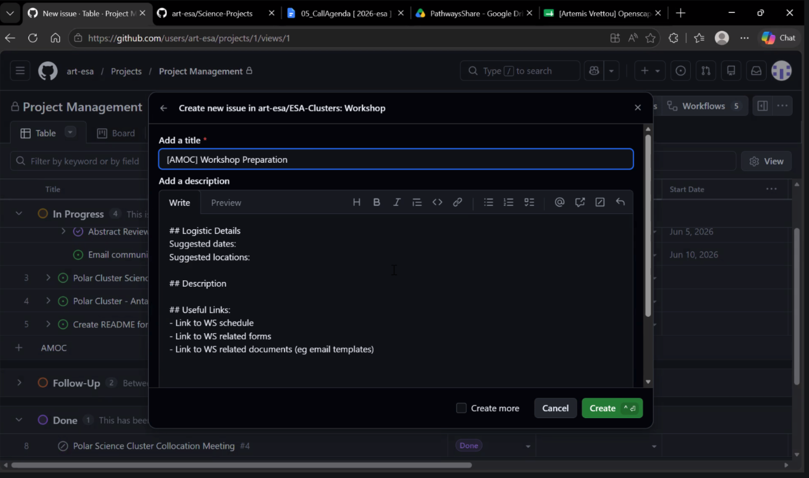
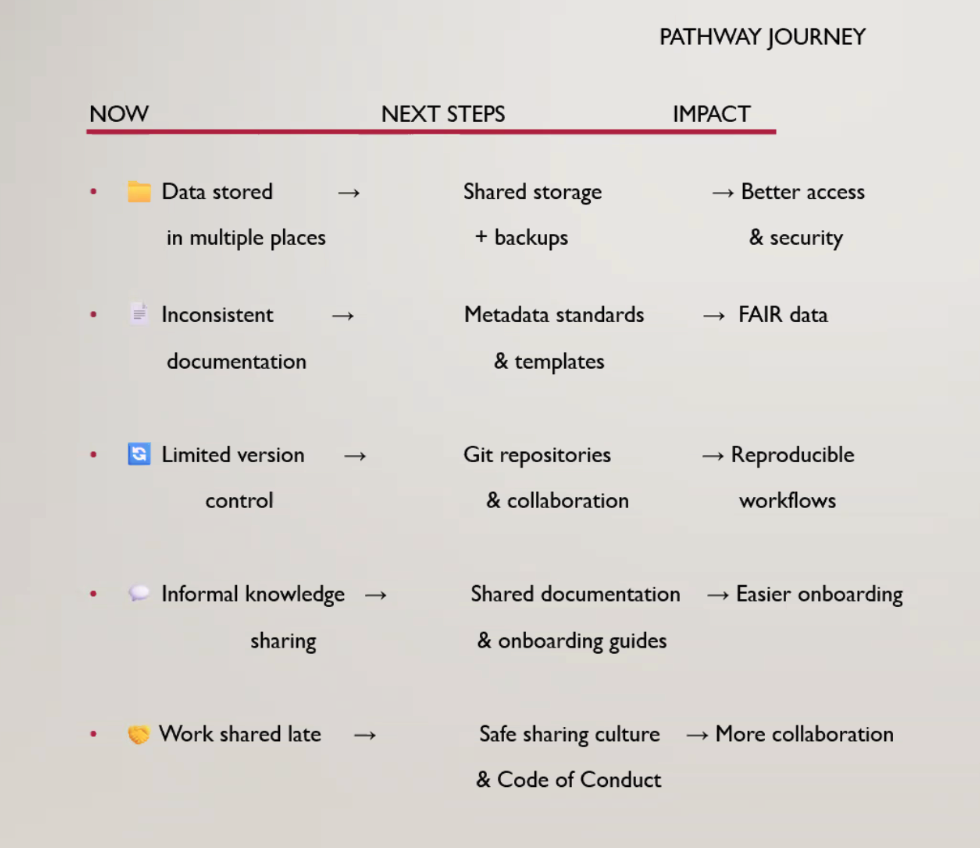
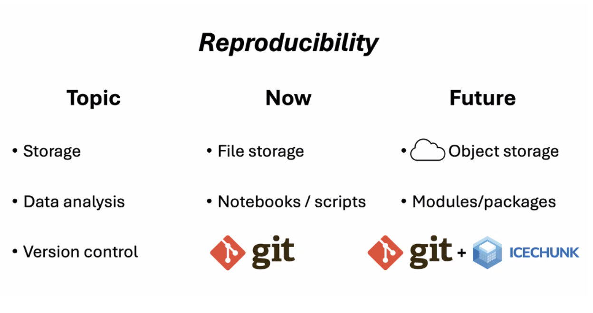
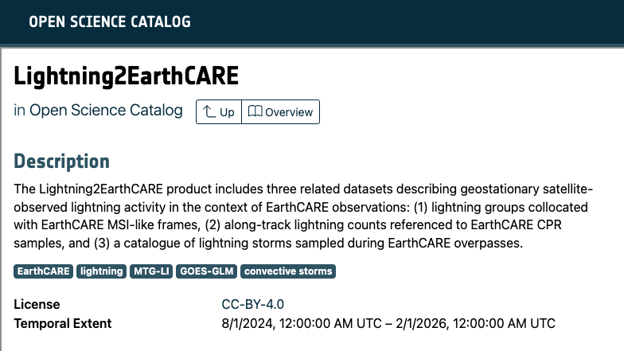

*This spring, ESA partnered with Openscapes to lead a 10–week Champions Cohort to explore open data science practices to help participants experiment and plan FAIR principles for Earth Observation and EarthCODE. This is a short post of what participants learned and what we did, all with an eye toward reuse and growing the open science movement.*

*Quicklinks:*

- Cohort webpage: <https://openscapes.github.io/2026-esa/>
- Better science for future us ([slides](https://docs.google.com/presentation/d/13rZnx2ybgKIYlN36ugCPH0e2RfaiQefxwmhv5F_mfqc/), [video](https://youtu.be/FfpA_Ja8xPw)), by [Andrew (Andy) Barrett](https://nsidc.org/about/about-nsidc/what-we-do/our-people/andrew_barrett), Senior Associate Scientist, US National Snow & Ice Data Center (NSIDC), [NASA Openscapes](https://nasa-openscapes.github.io/) Mentor.
- Data strategies for Future Us: Documenting your Data ([slides](https://docs.google.com/presentation/d/1CgpNio4tdP04cVWxCnGvqbT24ih9slXStP8T8RjPIAc/)), by Krasen Samardzhiev, [Lampata](https://lampata.co.uk/).
- FAIR strategies for Future Us: Tools, standards & technologies supporting FAIR in the EarthCODE federation ([slides](https://docs.google.com/presentation/d/1GYNPRVn9g1cP0YwdbAc_aoPsra1H8bpKlTprSOekorQ/), [video](https://youtu.be/ftcmAVyJLAs?si=aFspHdX9qyVGLJ5e)), by Krasen Samardzhiev, Lampata.

*Cross-posted at [earthcode.esa.int/blog](https://earthcode.esa.int/blog/esa-champions-cohort) and [openscapes.org/blog](https://openscapes.org/blog).*

------------------------------------------------------------------------

## EarthCODE and Openscapes

From April to June 2026, EarthCODE collaborated with Openscapes to host a 10-week ESA Champions Cohort where researchers explored open science and FAIR principles and planned how to incorporate these skills into their work with Earth Observation (EO) for Earth system science. [ESA EarthCODE](https://earthcode.esa.int/) is part of the European Space Agency (ESA)’s vision for Earth Observation Open Science and Innovation. EarthCODE enables scientists to find and reuse research data, use integrated EO platforms to develop scientific workflows, and publish them by automating the “[FAIR](https://www.go-fair.org/fair-principles/?)ification” process - making digital assets more Findable, Accessible, Interoperable, and Reusable. The Champions Cohort provided a shared, welcoming place for researchers to ask questions and build relationships as they learned together; its goals as a training activity were to build habits for long-term workflow change while connecting researchers using ESA data and strengthening the EarthCODE community 

::: blockquote-blue
> *“Having a practice that allows research to continue being used after researchers leave the lab - this resonated with me a lot”* - a participant comment during Call 1
:::

Participants were mainly from key EarthCODE stakeholder groups: researchers in the Earth System Science Hub, ESA ɸ-Lab, and ESA Science Clusters, and many of them were in person together at [ESRIN](https://www.esa.int/About_Us/ESRIN/) (ESA’s Centre for Earth Observation in Frascati, Italy). Other participants were from Europe, India, and Africa; they are scientists using ESA EO data in their research and who heard about the Champions Cohort via open science networks during the nomination period. These researchers study forests, clouds, sea ice, drought, cryosphere, wildfire, sea level rise, socio-ecological systems, extreme and compound event analysis. They use many different technologies for their science, including Python, GitHub, STAC APIs, Zenodo, data cubes, Overleaf, Jupyter Notebooks, HPCs, and were keen to learn more about how to collaborate, document, and improve their workflows.

::: {style="text-align:center;"}
{fig-alt="video conference participants in a 4 by 4 grid. People are smiling and waving" fig-align="center" width="60%"}
:::

## Impacts: putting new ideas to immediate use

Some immediate impacts of the Cohort were around habits and infrastructure that are key to collaborative research. We have heard that Amy Swiggs (Science Hub) and Artemis Vrettou (ESA Polar Science Cluster) have taught a session on open science in the polar community and have been reusing open facilitation approaches, including open time-keeping (where you have time-blocks identified in a shared agenda that you live-edit to silently communicate to all participants and facilitators). In response to survey questions asking “Have you incorporated any new ideas regarding collaborative workflows or open team culture and meetings?”, participants responded:

::: blockquote-blue
> *"Yes I have included metadata, FAIR principles and now I will practice project management via git."*
:::

::: blockquote-blue
> *"Definitely! I will try to make the live agenda docs for future meetings or workshops."*
:::

::: blockquote-blue
> *"Yes!! Seaside chats will be implemented and a more effective way of documenting and keeping track of my work is being implemented as we speak."*
:::

Seaside Chats ([Lowndes et al. 2019](https://openscapes.github.io/supercharge-research/)) are when a team meets together independently for dedicated time for data/workflow discussions. Seaside Chats have been described by participants in the 29 Cohorts Openscapes has led since 2020 as one of the most valuable parts of the Champions Program because it helps strengthen habits and a culture of shared workflows and learning. This was also the case here in the ESA Cohort, and it is exciting to think of people in person at ESRIN being able to continue these practices together. 

Our final Cohort Call is when participants opt-in to share their work-in-progress, challenges, and questions. During these low-key presentations, it was exciting to hear what questions people had for each other, and how they saw what others were doing and were inspired to do the same. For example, when Artemis Vrettou showcased her new project management setup with GitHub issues and Projects to aid her scientific support to 11 projects, Ewelina Dobrowolska (ESA Cluster) used her presenting time to discuss out-loud what it would look like for her to implement as well.

::: {style="text-align:center;"}
{fig-alt="screenshot of a GitHub Project with a new draft Issue in foreground, titled ‘[AMOC] Workshop Preparation. Issue Description has headings and lists in markdown format" fig-align="center" width="70%"}
:::

Others mentioned how they are incorporating FAIR principles into their existing work. Netra Bhandari (Environmental Informatics group, University of Marburg) said she is already reusing the FAIR lesson in her courses. This was also the case for Marian Puie (Geography PhD candidate at the University of Bucharest), who shared about improving data management practices for GeoAI work focused on hazard detection. He uses the YOLO (you only look once) AI tool that reduces processing time of the huge volume of images he processes. But his challenge is that much of the  AI code output is fragmented, and in multiple languages, and FAIR practices was something he identified to help him.

::: {style="text-align:center;"}
{fig-alt="3 columns labeled Now, Next Steps, Impact" fig-align="center" width="50%"}
:::

Another impact is connecting with people outside of the ESA community to see what is possible and establish workflows with existing tooling used elsewhere. Ross Slater (University of Leeds) is using Sentinel-1 data to measure the flow of Antarctic and Greenland ice sheets. He appreciated Andy Barrett’s lesson during Call 1 about his journey incorporating open practices and tools into his work as a field glaciologist ([slides](https://docs.google.com/presentation/d/13rZnx2ybgKIYlN36ugCPH0e2RfaiQefxwmhv5F_mfqc/edit?slide=id.g3d56774bae7_0_0#slide=id.g3d56774bae7_0_0)). Ross shared how he is working with multi-terabyte data cubes from [NetCDF](https://www.unidata.ucar.edu/software/netcdf) and [Zarr](https://zarr.dev/), and has developed  scripts and data that he is working to make easier to share with people in his group (and the wider community). Using [Icechunk](https://icechunk.io/en/stable/) is part of this, and Ross is now connected in Openscapes Slack in ongoing discussions about using Icechunk with NASA and NOAA colleagues as well. Ross is looking into using Quarto on GitHub to document things all in one place. He noted that relying on messaging accounts to view past conversations was not a robust way to reliably document workflows, as even within the same software, changing job titles meant that accounts changed and conversations were unrecoverable.

::: {style="text-align:center;"}
{fig-alt="Slide titled Reproducibility with 3 columns labeled Topic, Now, Future" fig-align="center" width="50%"}
:::

One final big impact in this Cohort was the opportunity to discuss an emerging topic of how people are using AI to learn – and the impacts of this on open communities and relationships in person at an organization like ESRIN. Krasen shared Mara Averick’s [post](https://blog.stdlib.io/ai-and-the-invisible-newcomer-in-open-source/) called “What We're No Longer Seeing: AI and the Invisible Newcomer in Open Source. How AI is absorbing the visible friction that open-source communities have always relied on to see—and welcome—newcomers.” This sparked a thoughtful discussion across two calls: noticing and having a space to discuss is how we all figure out how we want to work.

## Core lessons reused plus new FAIR lessons

This inaugural ESA Champions Cohort took place over 5 virtual sessions. Each cohort call included a welcome and code of conduct reminder and two teaching sessions with time for reflection in small groups or silent journaling and group discussion before closing with suggestions for future team meeting topics (“Seaside Chats”), and Open Science Tips. All topics and the slides presented are shared on the [2026 Cohort page](https://openscapes.github.io/2026-esa/). Additional coworking sessions were scheduled in alternate weeks, where researchers could work quietly, screenshare to ask questions, or meet with their team to discuss further.

Openscapes lessons develop mindsets around “Future Us” (working for yourself with an eye towards other contributors) and “Forking as a worldview” (expecting that the thing you need exists, and appreciating that forward). We taught most of the [core lessons](https://openscapes.github.io/series/what-to-expect.html#cohort-calls): open mindset; Better science for future us; GitHub for publishing and project management; team culture, data strategies for future us; coding strategies for future us; open communities – which Openscapes has refined in previous 29 Champions Cohorts. We also had key iterations to the series:

- **Better science for future us:** this lesson was contributed by Andy Barrett (details in Quicklinks above) Andy uses foundation models and machine learning for mapping sea ice. He shared about his evolution as a scientist from recognizing “A year is too long to remember where a script was stored, or which script updated observed data” to now experimenting with Quarto and Jupyter Notebooks to write executable papers.

- **Metadata strategies for future us**: this data strategies lesson was presented by Krasen Samardzhiev (details in Quicklinks above), who onboarded to Openscapes teaching via teaching an existing lesson (reuse is an important part of open science) and tailored it to the EO audience. The slides are a metadata lesson contributed by Dr. Rachael Blake ([Intertidal Agency](https://www.intertidalagency.org)) for three [2025 NOAA Fisheries Champions Cohorts](https://openscapes.org/blog/2026-02-26-nmfs-champions-2025/), and have since been reused in Intertidal Agency’s inaugural Data Stewardship Cohort. 

- **Tools, standards, and technologies supporting FAIR in the EarthCODE federation:** this new lesson was developed by Krasen Samardzhiev (details in Quicklinks above). Krasen introduced the FAIR Guiding Principles (Wilkinson et al, [2016](https://www.nature.com/articles/sdata201618)) that provide a structured approach to managing data and its metadata, ensuring that both data and processing workflows can be efficiently discovered, accessed, and used across disciplines. He introduced [EarthCODE](https://esa-earthcode.github.io/documentation/) and then presented the [Lightning2EarthCARE](https://opensciencedata.esa.int/products/earthcare-frame-lightning/collection) datasets entry in the [Open Science Catalog](https://opensciencedata.esa.int) that was contributed by Champion, Blanka Piskala (ESA Science Hub) highlighting how and where this makes the data Findable, Accessible, Interoperable, and Reusable. Krasen worked with Blanka in using the [EarthCODE Library](https://esa-earthcode.github.io/earthcode-library/README.html) (Python) to create the Lightning2EarthCARE entry.

::: {style="text-align:center;"}
{fig-alt="screenshot from Lightning2EarthCARE datasets entry in Open Science Catalog. Text Description says, The Lightning2EarthCARE product includes three related datasets describing geostationary satellite-observed lightning activity in the context of EarthCARE observations: (1) lightning groups collocated with EarthCARE MSI-like frames, (2) along-track lightning counts referenced to EarthCARE CPR samples, and (3) a catalogue of lightning storms sampled during EarthCARE overpasses." fig-align="center" width="70%"}
:::

Through this whole cohort and planning process, we were also growing skills in people supporting research from ESA and the EarthCODE consortium. Part of working with Lampata included teacher preparation and coaching, and folks like Ewelina Dobrowolska from ESA joined the Cohort both as participants and in supporting roles – what Openscapes calls Mentors :)

::: blockquote-blue
> *"Openscapes helped bring together the different aspects of research management into a more coherent approach. Having a centralised board with project management tools to track deliverables would further support my work by improving efficiency and speeding up communication with other teams and collaborators. The programme also strengthened my understanding of Open Science. Although I was already familiar with many concepts, I now have a clearer perspective on the challenges researchers face in publishing and developing their work while remaining FAIR-compliant."* - **Ewelina Dobrowolska, ESA**
:::

## Onward: What we learned and and themes that emerged

In leading this cohort together, Openscapes learned a lot about how ESA researchers work and gained valuable insights for continuing to iterate our Champions lessons.

**Strategies for documenting early**. It can be hard to document a workflow at the beginning of a project, because we don’t know where the analysis will go.

**Openscapes will incorporate the AI conversation into our Open Communities lesson:** how to work with responsibility and how this goes with an open environment.

**Few people attended Coworking.** Coworking[(Lowndes et al. 2024)](https://onlinelibrary.wiley.com/doi/10.1002/ece3.11341) in Champions Cohorts is when people come to get their own work done and the Openscapes and Lampata teams were available to help troubleshoot, teach depending on what people need. Low attendance has been noted for some past Cohorts, although the ESA Cohort had particularly low attendance. Was it scheduled at a bad time? Did we not communicate the value? Were people just overloaded with other parts of their work-lives and had to let this go? Something to consider for future Cohorts.

This was the first Champions Cohort that Openscapes has led with ESA researchers, and we are so thrilled with this opportunity and how it went! As we prepare for the [2026 ESA Hackathon](https://earthcode.esa.int/blog/Hackathon-2026), we will be able to put these lessons to immediate use to design it in a way that can meet more of ESA researcher needs.
