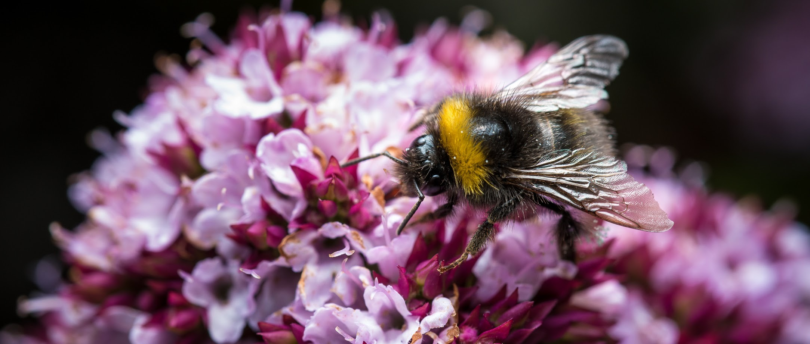

*NOAA Fisheries is currently leading a sustained effort to migrate their data and workflows to the cloud. This means new ways of working that are not only on our own laptops but in shared compute environments, with standardized metadata and data accessed from the cloud, all with new concepts, terminology, and software. This migration is not just about technology: giving all staff new software and updated permissions is not enough. The question is: does it work for people? Do they know how to use it, does it work with their science needs, for example managing confidential data? Can Google Workstations, a newly available cloud computing environment, analyze data that is newly stored in Google Drive? Surfacing and building solutions to these challenges need social approaches, not only technical ones. For the fourth year as an Openscapes Mentors community across agencies (including NOAA Fisheries, NASA Earthdata, California Water Boards, Intertidal Agency, Fred Hutch, Lampata), we continued to develop coaching skills together that make us better mentors to support these large shifts in the way organizations work. This 5-part series was  funded by NOAA Fisheries for the second year, led by certified coaches Tara Robertson and Alvin Pilobello.*

------------------------------------------------------------------------

::: {.blockquote-blue}
> *"Wow, in 3 questions my partner helped me see that I am facing an emotional barrier, not a technical barrier. This changes how I will put my effort"* **--- Openscapes Mentor**
:::

::: {.blockquote-blue}
> *"quote"* **--- name**
:::

{fig-alt="A bee standing on a pink flower with multiple florets, against a black background" width="85%" fig-align="center"}

::: {.caption-text .center-text}
Photo by Elliot Lowndes
:::
