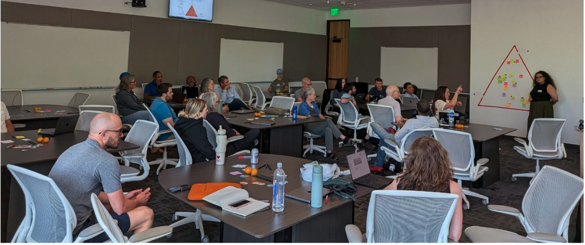

*In July 2026, we participated in the [ESIP (Earth Systems Information Partners) Summer Meeting](https://2026julyesipmeeting.sched.com/) in Austin, Texas convening virtual and in-person participants under the theme of Bridging Divides: Data, Technology, Community. ESIP meetings are a unique and well-coordinated combination of community, conversation, and creativity that transforms the usual conference experience into an interactive and engaging meet-up for dreamers and doers alike. This year, the [NASA Openscapes](https://nasa-openscapes.github.io/) and [earthaccess](https://earthaccess.readthedocs.io/en/stable/) communities hosted a hackday to gather anyone interested in “making things easier for scientists” from policy, social, and technical perspectives. “Hackday” to us means collaboratively problem-solving and strategizing, and translating ideas into action. This includes decisions, code, and documentation. [earthaccess was one of the winners of ESIP’s FUNding Friday](https://earthaccess.readthedocs.io/en/latest/growing/esip-funding-friday-song-lyrics/) at the July 2025 ESIP Meeting, supporting a [hackday in December](https://openscapes.org/blog/2026-02-04-earthaccess-dec15-hackday/), and we were grateful the ESIP staff provided us a room to host one again. Here is some of what we all learned along the way!*

*Quicklinks:*

- [*Sched - ESIP July Meeting*](https://2026julyesipmeeting.sched.com/)
- [*Agenda Doc*](https://docs.google.com/document/d/17X5B8k1M-2nAA7OoAm7dlBHnWzvD3gyoAgUSfWnKh8A/edit?usp=sharing) *with topic pitches beforehand and live notes during the hackday*
- [*People, structure, mechanics: How we led the earthaccess December 15 Hackday*](https://openscapes.org/blog/2026-02-04-earthaccess-dec15-hackday/)
- *ESIP July Meeting Highlights Webinar ([slides](https://zenodo.org/records/22099706), [recording](https://www.youtube.com/watch?v=5cbM78GVufM)) on August 26, 2026*
- *Powerful Questions [card deck](https://github.com/Openscapes/powerful-questions-card-deck)by Tara Robertson*
- *Outputs from the Hackday:*
  - [*STAC GitHub issue in the Earthdata Cloud Cookbook*](https://github.com/NASA-Openscapes/earthdata-cloud-cookbook/issues/501)

  - [*Extract model values GitHub Issue in the point-collocation library*](https://github.com/fish-pace/point-collocation/issues/147)

  - [*earthaccess benchmark testing for downloading vs. streaming data*](https://github.com/earthaccess-dev/earthaccess/issues/1407)

  - [*Improve tutorial discoverability in earthaccess*](https://github.com/earthaccess-dev/earthaccess/issues/1406)

*Cross-posted at [openscapes.org/blog](http://openscapes.org/blog), <https://nasa-openscapes.github.io/news>* 

------------------------------------------------------------------------

## **Arriving in the action**

As conference attendees arrived in preparation for the upcoming meeting, our Hackday room in the conference center quickly filled, and with participants came an air of excitement. While setting up to begin, we could hear snippets of conversations, meetings, and reunions. Questions of “how far did you come from?” and introductions followed by “wow, it’s so awesome to see you in person!” swirled around the room as we all began to gather for our time “hacking” together. Hacking can mean many things, and more often than not it is associated with hands-on coding and troubleshooting, however, here we were hacking on decisions. Specifically, we challenged everyone to consider the friction in their work and the barriers to the implementation, usability, or social infrastructure for success that exist for their projects. We shared frustrations, heard successes, enjoyed the ease of asking questions while all in the same room, and ultimately came out with stronger projects and ideas on the other side. 

## The Hackday : what we did

*A timeline of the Hackday*

*Before joining us at ESIP we asked attendees to answer “What problem do you think needs solving?” in a shared ideas document. We used this as a guide to design collaborative breakout groups during the session. Attendees could also arrive and pitch new ideas!* 

1:30-2:30 pm CDT - Welcome; pitches

2:30-4:00 pm CDT - Breakout groups

4:00-4:10 pm CDT - Midway Check-in

4:10-5:30 pm CDT - Breakout groups

5:15 pm CDT - Stop Hacking; summarize where you’ve gotten to and communicate

5:30 pm CDT - Final Shareouts

6:00 pm CDT - Close out, transition to social time!

6:30-9pm CDT - Openscapes Happy Hour

Openscapes hosted this Hackday the day before formal programming for the conference began. Logistically, most ESIP attendees arrive on Day 0 as conference activities begin at 8 AM on Day 1. Those in attendance chose earlier flights and made arrangements to join us the afternoon before, which we intentionally planned so folks would not have to add extra travel to come! The space was generously provided by ESIP and coordinated by the Openscapes community.

35 participants joined us, from across different agencies and organizations (NASA, NOAA, Open Geospatial Consortium, Federal Geographic Data Committee, Open Science Computing). 

## **What we learned together**

Over the course of the five hours we spent together, we used a combination of community building tools (group icebreaker, silent journaling, agenda in a shared Google doc for collaborative note taking) and active conversation (in breakouts and reporting out to the group) to encourage connection, ideation, and documentation, for folks to hack on. We had four breakout groups with the following topics: 

*earthaccess onboarding \| Goal: Development of clear and practical use cases with a focus on new user onboarding and documentation of user challenges (Lead: Amy Steiker, NSIDC DAAC)*  

::: callout-note
earthaccess is a community-driven python library that enables access to nasa’s earth science data with just a few lines of code. (<https://earthaccess.readthedocs.io>)
:::

*STAC (SpatioTemporal Asset Catalogs) \| Goal: To support a broader vision of interoperable metadata cataloguing and to explore earthaccess as a pathway for success (Lead: Danny Kaufman, ASDC and Ian Carroll, OB.DAAC)*

::: callout-note
STAC specification is a common language for describing and cataloguing files of geospatial information about the earth captured in a certain space and time. (https://stacspec.org/)
:::

*Point-collocation \| Goal: To test and develop pre-existing examples of new user workflows and identify challenges to usability. (Lead: Eli Holmes, NOAA Fisheries)*

::: callout-note
point-collocation is a Python library built as an earthaccess plug-in that can combine data from field stations, animal tracks, survey points, or other lat/lon/time observations and the corresponding satellite or model values from NASA Earthdata (https://fish-pace.github.io/point-collocation)
:::

*earthaccess virtual datasets \| Goal: Identifying ergonomic and performance opportunities with earthaccess virtual access patterns. (Lead: Luis Lopez)*

::: callout-note
Virtual data stores is an approach that enables data that is not cloud-optimized to masquerade as cloud-optimized, something required in order to stream data instead of downloading ([NASA blog](https://www.earthdata.nasa.gov/news/feature-articles/working-non-cloud-optimized-data-just-got-easier), [virtualzarr.cloud](https://virtualzarr.cloud/news)) 
:::

*(Transitioned to a social hour discussion) Earth data in the age of AI agents + how they are changing the game.*

Across all breakout groups there were three themes that emerged time and time again: interoperability, quality control, and user experience challenges. Below we share some of the actions, conversations, and powerful questions that emerged from our time together.\

**Interoperability + Quality Control**

Within the STAC group, participants identified earthaccess as a good place to start hacking on improved interoperability in data cataloging. Challenges the group identified included: richness of [CMR](https://www.earthdata.nasa.gov/about/esdis/eosdis/cmr) (NASA’s common metadata repository), data getting lost, limitations around storing search results for future use, and the necessity to reduce CMR hits in order to increase efficiency.  

During the Hackday they asked the following: **What is a small step we can take?**

\

As a group they determined their step to be drafting a new section/page for the Earthdata Cloud Cookbook, under Core Concepts to cover Metadata Catalogs. Their time together resulted in drafted language, suggested content, and references to include, outlined in a [GitHub Issue](https://github.com/NASA-Openscapes/earthdata-cloud-cookbook/issues/501).

\
Heading H2

Text

::: blockquote-blue
> *"Quote in italics"* - **Name, Affiliation in boldface**
:::

**An image:**

::: {style="text-align:center;"}
{fig-alt="A room full of seated Hackday participants is looking toward the presenter of the breakout group activity. The activity is displayed on a wall and made up of sticky notes within a triangle of red tape, representing the spectrum of audience perspectives on collaboration." fig-align="center"}
:::

**An image with text beside it**, added by using columns. Column widths must add up to 12:

::::: grid
::: g-col-2
{fig-alt="The earthaccess logo by Allison Horst: a hexagonal shape with the words earth access on two separate lines with pixelated sky with clouds and earth with land and sea" fig-align="left" width="100%"}
:::

::: g-col-10
Join us to celebrate `earthaccess`, a python library that simplifies search and access of NASA Earth science data to a few lines of code.

We will record the presentations and post on [Openscapes YouTube](https://www.youtube.com/@openscapes/videos).
:::
:::::

## For an event

**Date**: Tuesday, July 29, 2025 **Time**: 9:30 - 11:00 am PT ([find your local time](https://www.timeanddate.com/worldclock/fixedtime.html?msg=Community+Call%3A+What+we%E2%80%99re+learning+about+cloud+costs+for+Earth+science+workflows+in+our+JupyterHub&iso=20250422T0930&p1=1050&ah=1)) <!---**Where**: Zoom
**Register (free)** via [Zoom](https://zoom.us/meeting/register/Lnt3E9NRSK-deXCN1kkviw) to get the meeting link.---> **View** [recording](https://youtu.be/t8gUSUlSqnc)<!--- and [summary](/blog/LINK).--->
