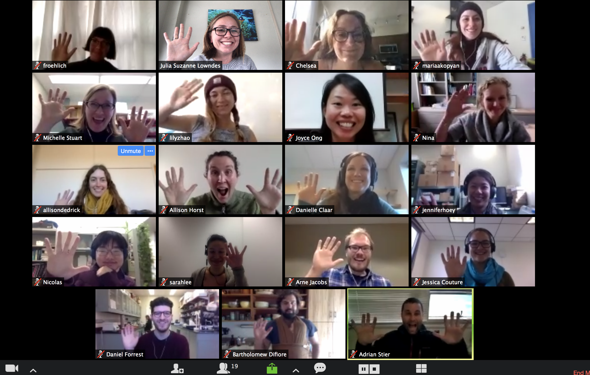

```{r setup, include=FALSE}
knitr::opts_chunk$set(echo = FALSE)
```

## Cohort Summary 
Sponsored by Mozilla.

**Related blog posts & media**: 

- [Supercharge your research: a ten-week plan for open data science](https://www.nature.com/articles/d41586-019-03335-4). *Nature,* 2019. Julia S. Stewart Lowndes, Halley E. Froehlich, Allison Horst, Nishad Jayasundara, Malin L. Pinsky, Adrian C. Stier, Nina O. Therkildsen & Chelsea L. Wood. 
- [Openscapes Champions incorporate open practices in their science](https://www.openscapes.org/blog/2019/03/27/champions-incorporate-open-science/)
- [Openscapes summit reflections — Becoming Champions](https://www.openscapes.org/blog/2019/04/08/summit-reflections1/)
- [Openscapes summit reflections 2 — Changing the way we do science](https://www.openscapes.org/blog/2019/04/25/summit-reflections2/)
- [Wins from the inaugural Champions cohort](https://www.openscapes.org/blog/2019/06/12/wins-cohort1/)
- [Champions Summit 2019](https://openscapes.github.io/summit2019/)

**Participating teams led by**: 

[**Halley Froehlich, PhD**](https://halleyfroehlich.wordpress.com/) — **University of California at Santa Barbara.** 
A marine aquaculture & fisheries scientist studying global systems. 

[**Allison Horst, PhD**](https://www.bren.ucsb.edu/people/Faculty/allison_horst.htm) — **University of California at Santa Barbara.** 
A data science and statistics lecturer in an environmentally-focused graduate program.

[**Nishad Jayasundara, PhD**](https://umaine.edu/marine/faculty/nishad-jayasundara/) — **University of Maine.** 
A physiologist studying organismal adaptation to their habitat & effects of external environmental factors.

[**Malin Pinsky, PhD**](http://pinsky.marine.rutgers.edu/) — **Rutgers University.**
An ecologist studying the impacts of climate change on ocean life.

[**Adrian Stier, PhD**](https://www.oceanrecoveries.com/) — **University of California at Santa Barbara.** 
A marine ecologist studying recovery and resilience of ocean ecosystems. 

[**Nina Therkildsen, PhD**](https://www.therkildsenlab.com/) — **Cornell University.** 
An evolutionary biologist using genomic analyses to improve marine conservation and fisheries management.

[**Chelsea Wood, PhD**](https://chelsealwood.wordpress.com/) — **University of Washington.** 
An ecologist studying marine and freshwater parasites and infectious disease in a changing world.


```{r, out.width="100%", fig.align='center', preview=TRUE}
  
```


## Program Overview

Learn more about Openscapes and the Champions Program: <https://openscapes.org>. 


