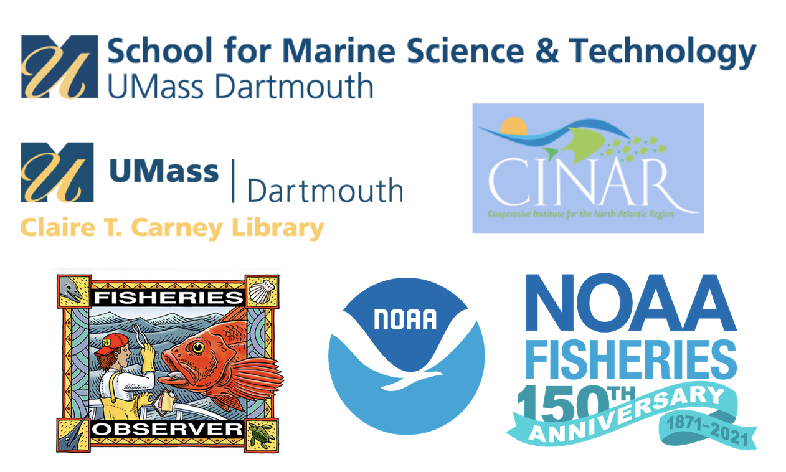

```{r setup, include=FALSE}
knitr::opts_chunk$set(echo = FALSE)
```


## Cohort Summary 
Sponsored through NOAA Fisheries Northeast Fisheries Science Center ([NEFSC](https://www.fisheries.noaa.gov/about/northeast-fisheries-science-center)) and a grant from the [Fisheries Information System Program](https://www.fisheries.noaa.gov/national/commercial-fishing/fisheries-information-system-program) through an award to [UMass Dartmouth-SMAST](https://www.umassd.edu/smast/) through [CINAR](http://www.cinar.org/).

**Website and participating teams:**

- <https://openscapes.github.io/2021-fdd/>

**Related blog posts**: 

- [Identifying common approaches and needs for fisheries dependent data](https://www.openscapes.org/blog/2021/11/12/fdd-champions/)


## Program overview

**This is a professional development and leadership opportunity for FDD research groups to explore open data science practices.**

**[Openscapes](https://openscapes.org)** is an approach for doing better science in less time[^1]. We help research groups reimagine data analysis, develop modern skills that are of immediate value to them, and cultivate collaborative and inclusive research communities. Openscapes’ mentorship and community engagement approaches center on open data science as kinder science[^2], enabling increased efficiency and resilience for teams so that their work has more enduring impact. 

**[Openscapes Champions](https://www.openscapes.org/champions/)** is a remote-by-design mentorship program for environmental and Earth science research teams to explore open data science practices. Participants attend as a team with their research group in a cohort with other teams, together learning how to reframe data-intensive science as a collaborative effort. By discussing open software tooling and communities enabling reproducible research (e.g. R/Python, GitHub, metadata), participants develop collaborative skills, mindsets, and habits and establish shared practices for increased efficiency in their own research, while contributing to a more inclusive scientific culture. 

**Fishery Dependent Data (FDD) **represent a complex mix of information collected to facilitate managing the region's living marine resources. In the Northeast, data flow from individual businesses and/or scientific samplers to the region's scientific and management organizations. This web of information can be difficult to access as much of the content is confidential in its raw form. Further, many of the codes and systems used to store these data are poorly documented, and even routine analyses are not commonly shared among data users. Currently, FDD are therefore difficult to integrate into scientific advice for ecosystem based fisheries management. Analysts tend to be unfamiliar with the data or hesitant to explore their potential, and data can be viewed with skepticism rather than leveraged in new and innovative ways. There is a need to begin to provide access, documentation, and cultivate a community of practice that focuses on using these data to their full potential.

**This opportunity is funded through NOAA Fisheries Northeast Fisheries Science Center ([NEFSC](https://www.fisheries.noaa.gov/about/northeast-fisheries-science-center)) and a grant from the [Fisheries Information System Program](https://www.fisheries.noaa.gov/national/commercial-fishing/fisheries-information-system-program) through an award to [UMass Dartmouth-SMAST](https://www.umassd.edu/smast/) through [CINAR](http://www.cinar.org/).** It is coordinated by Gavin Fay (UMassD-SMAST), Andy Jones (NOAA NEFSC), and Rachel Baum (UMassD Claire T. Carney Library).


```{r, out.width="50%", fig.align='center', preview=TRUE}
  
```


## Cohort details

**Our FDD Cohort will meet four times over two months, on alternating Fridays.**

* **Dates: **Sep 17, Oct 1, Oct 15, Oct 29, 2021
* **Times: **12:00-1:30 pm EDT 
* **Where:** remotely, via Zoom
* **Who: **Cohort of 7 FDD user teams (or research groups). Each team consists of a team lead (PI, project supervisor, or faculty, etc) and up to 4 team members of your choice (analysts, technicians, students, postdocs, etc). 
* **Cost:** Free; this opportunity is sponsored by FDD through an award to [UMass Dartmouth-SMAST](https://www.umassd.edu/smast/) through [CINAR](http://www.cinar.org/).
* **Expected time commitment:** The minimum expected time commitment is 6hrs/month for 2 months. This includes 3 hours/month over Zoom as a full Champions Cohort, as well as teams meeting independently to further discuss topics between Cohort Calls. 

## Nominate your team to participate

Nominate your team by filling out this [Google Form](https://docs.google.com/forms/d/e/1FAIpQLSeUJUEqjRo0u4v5f8Ntv9qhDeGA6TkHmxlW1TjH0mg_3dDCDw/viewform?usp=sf_link) by August 20, 2021. This opportunity is open to those affiliated with teams using FDD in the Northeast US. Please submit one nomination per team, preferably by the team lead (faculty, project manager. principal investigator, etc). We will confirm participation by late August 2021. 

Learn more about the [Openscapes Champions Program](https://openscapes.org/champions) and [FAQs about forming your team](https://openscapes.org/faq). Questions? Contact Openscapes: openscapes at nceas.ucsb.edu


[^1]:
     [nature.com/articles/s41559-017-0160](https://nature.com/articles/s41559-017-0160) 

[^2]:
     [blogs.scientificamerican.com/observations/open-software-means-kinder-science](https://blogs.scientificamerican.com/observations/open-software-means-kinder-science) 
