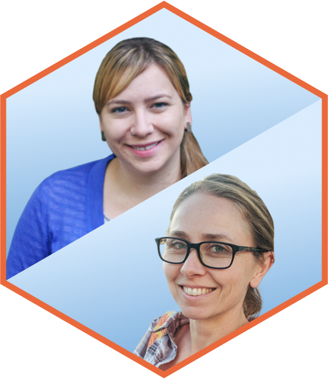

At rstudio::conf 2022, Julie Lowndes and Mine Çetinkaya-Rundel will co-deliver a keynote on Publishing and Collaborating with Quarto.

[Julie Lowndes](https://jules32.github.io/) is Founder & Co-Director of Openscapes and Senior Fellow, National Center for Ecological Analysis & Synthesis (NCEAS), University of California Santa Barbara (UCSB).

[Mine Çetinkaya-Rundel](https://mine-cr.com/) is Professor of the Practice and Director of Undergraduate Studies at the Department of Statistical Science at Duke University.

<https://www.rstudio.com/conference/>

{width="45%" fig-align="center"}
