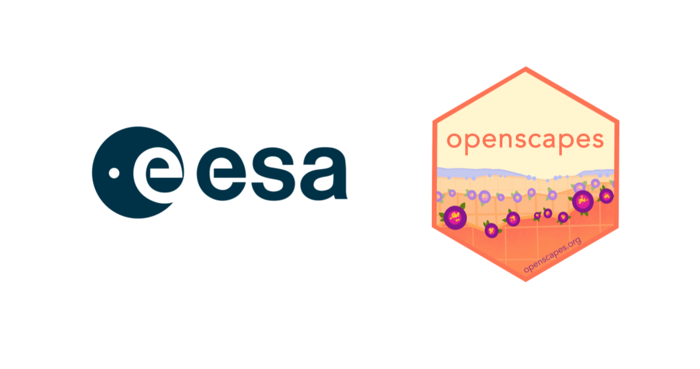

## Program overview

**This is a professional development and leadership opportunity for European Space Agency (ESA) affiliated researchers and people supporting ESA research** to explore open data science practices and strengthen collaboration and reproducibility. The spring 2026 Champions Cohort will run from **April 15th to June 10th, 2026**, meeting biweekly 14:00 - 15:30 GMT. Please nominate yourself **by March 25, 2026**.

[Openscapes](https://openscapes.org/) is an approach and a movement that helps researchers find each other and feel empowered to conduct data-intensive science [@lowndes2019; @robinson2022]. We mentor researchers to reimagine data analysis, develop modern skills that are of immediate value to them, and cultivate collaborative research communities. Openscapes’ approach has been recognized by NASA and other groups.

[Openscapes Champions](https://www.openscapes.org/champions/) is a remote-by-design mentorship program for researchers to explore open data science practices. Participants attend in a cohort together, and by discussing open software tooling and communities enabling reproducible research (e.g. R/Python, GitHub, metadata), you develop collaborative skills, mindsets, and habits and establish shared practices for increased efficiency in your own research, while contributing to a more inclusive scientific culture.

[ESA EarthCODE](https://earthcode.esa.int/) is part of the ESA’s vision for Earth Observation (EO) Open Science and Innovation. EarthCODE enables scientists to find and reuse research data, use integrated EO platforms to develop scientific workflows, and publish them by automating the “[FAIR](https://www.go-fair.org/fair-principles/?)ification” process - making digital assets more Findable, Accessible, Interoperable, and Reusable. In a first stage, the key EarthCODE stakeholder groups include the activities contributing to the various ESA Science Clusters, and the Earth System Science Hub.

## Cohort details

**We will meet as a cohort five times over two months**, on alternating Wednesdays, with additional optional coworking times. 

-   **Dates**: April 15, 29, May 13, 27, June 10.

-   **Times**: 14:00 - 15:30 GMT.

-   **Where**: remotely, via Zoom.

-   **Who**: ESA-affiliated researchers (postdoctoral fellows, graduate students, principal investigators, other academic researchers) and people supporting ESA research.

-   **Cost**: Free; this opportunity is supported by the ESA EarthCODE Project through a contract to Openscapes.

-   **Expected time commitment**: 6hrs/month for 2 months is an expected time commitment. This accounts for 3 hours/month of synchronous Zoom calls, optional coworking times, and collaborating with your peers to strengthen shared workflows.

For more information about the Openscapes and our Champions Program, see “Openscapes as a mechanism for Crossing the Chasm between idea and adoption in science” ([slides](https://docs.google.com/presentation/d/1B3dSYr0eptGgDL_V6EZchU_BrJ-uS3v2K-miDkbhSqc/)) and [What to Expect](https://openscapes.github.io/series/what-to-expect). For stories from over 25 past Openscapes Champions Cohorts from NASA Earthdata, NOAA Fisheries, other government agencies and academic groups, please browse these [blog posts](https://openscapes.org/blog#category=champions).

## How to apply

To nominate yourself, please **fill out the [ESA Openscapes Champions Cohort 2026 form](https://forms.gle/tE4GompYeJWN5Duu6) by March 25**. Open science is collaborative! We encourage you to sign up with a colleague or two – it is more fun to participate together and you have more accountability. You don’t need to be working on the same project, only an interest in improving workflows.

Questions? Contact hello \@ openscapes.org.

This opportunity is funded by the [European Space Agency EarthCODE](https://earthcode.esa.int/).

{fig-alt="logo of ESA on left with Openscapes logo on right" width="40%"}
