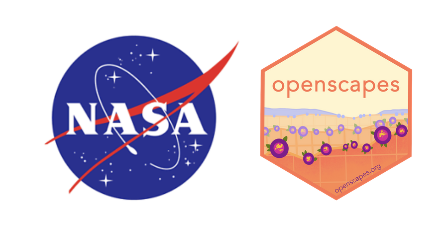

## Join us to do better science in less time, together

**This is a professional development and leadership opportunity for people doing
and supporting research using NASA Earthdata collected from suborbital
sampling** to explore open data science practices and make incremental and
sustainable change, no matter where you are starting from. The 2026 NASA
Suborbital Openscapes Champions Cohort will run in June 2026. We will meet as a
Cohort via Zoom four times over one month.

**Applications are open! Jump to [how to apply](#sec-how-to-apply), below.**

[Openscapes](https://openscapes.org/) is an approach and a movement that helps
researchers find each other and feel empowered to conduct data-intensive science
[@lowndes2019; @robinson2022]. Since 2019, Openscapes has mentored over 600
researchers at universities across the US and at NASA and NOAA, helping to shift
institutional culture to develop climate solutions with open science
[@lowndes2024].

[NASA Earthdata](https://www.earthdata.nasa.gov/) has volumes of remote sensing data collected by platforms in
space, air, water, and land. Substantial suborbital data is collected from
airborne sampling via airplanes, ground networks, and field sampling on land,
boats, and buoys. Suborbital science teams are teams that create and use
suborbital data via NASA programs like EVS-4. The science teams use suborbital
data to ground-truth satellite data, as well as to conduct other awesome
research like studying Arctic coastlines via the FORTE mission and glaciers and
ice sheets via the Snow4Flow mission. [Read about how Openscapes supports NASA
suborbital science teams](https://openscapes.org/blog/2026-03-03-suborbital/)

## Program details

[Openscapes Champions](https://www.openscapes.org/champions/) is a
remote-by-design mentorship program for researchers to explore open data science
practices. [Core lessons
include](https://openscapes.github.io/series/what-to-expect.html#cohort-calls)
open mindset, GitHub for publishing and project management, coding and data
strategies, and team culture. To support EVS-4 teams, this cohort will also
focus on documentation strategies for suborbital data.

The 2026 NASA Suborbital Openscapes Champions Cohort will run in June 2026. We
will meet as a Cohort via Zoom four times over one month for 1.5 hours, on
alternating Wednesdays or Thursdays. We propose the following three options:

 - **When**:
- **Times**: 10:00 - 11:30 am Pacific Time

  -  **Where**: remotely, via Zoom. 

  - **Who**: Researchers (postdoctoral fellows, graduate students, principal
  investigators, other academic researchers) and people supporting research with
  NASA airborne and suborbital data. Preference will be given to EVS-4 and SoAR
  teams if we reach capacity. 

  - **Cost**: Free. This opportunity is supported by NASA through a contract to
  Openscapes.

  - **Expected time commitment**: 2.5hrs/week for 1 month is an expected time
  commitment. This accounts for 1.5 hours/week of synchronous Zoom calls, plus
  self-organized time 

For more information about the Openscapes and our Champions Program, see
“Openscapes as a mechanism for Crossing the Chasm between idea and adoption in
science”
([slides](https://docs.google.com/presentation/d/1B3dSYr0eptGgDL_V6EZchU_BrJ-uS3v2K-miDkbhSqc/))
and [What to Expect](https://openscapes.github.io/series/what-to-expect). For
stories from over 25 past Openscapes Champions Cohorts from NASA Earthdata, NOAA
Fisheries, other government agencies and academic groups, please browse these
[blog posts](https://openscapes.org/blog#category=champions).

## How to apply {#sec-how-to-apply}

To nominate yourself, please **fill out the [nomination
form](https://forms.gle/oQv7Pd1pxbFJ8iLy9) by May 24**. Open science is
collaborative! We encourage you to sign up with a colleague or two – it is more
fun to participate together and you have more accountability. You don’t need to
be working on the same project, only an interest in improving workflows.

Questions? Contact hello \@ openscapes.org.

{fig-alt="logo of NASA on left with Openscapes logo on right" width="40%"}
